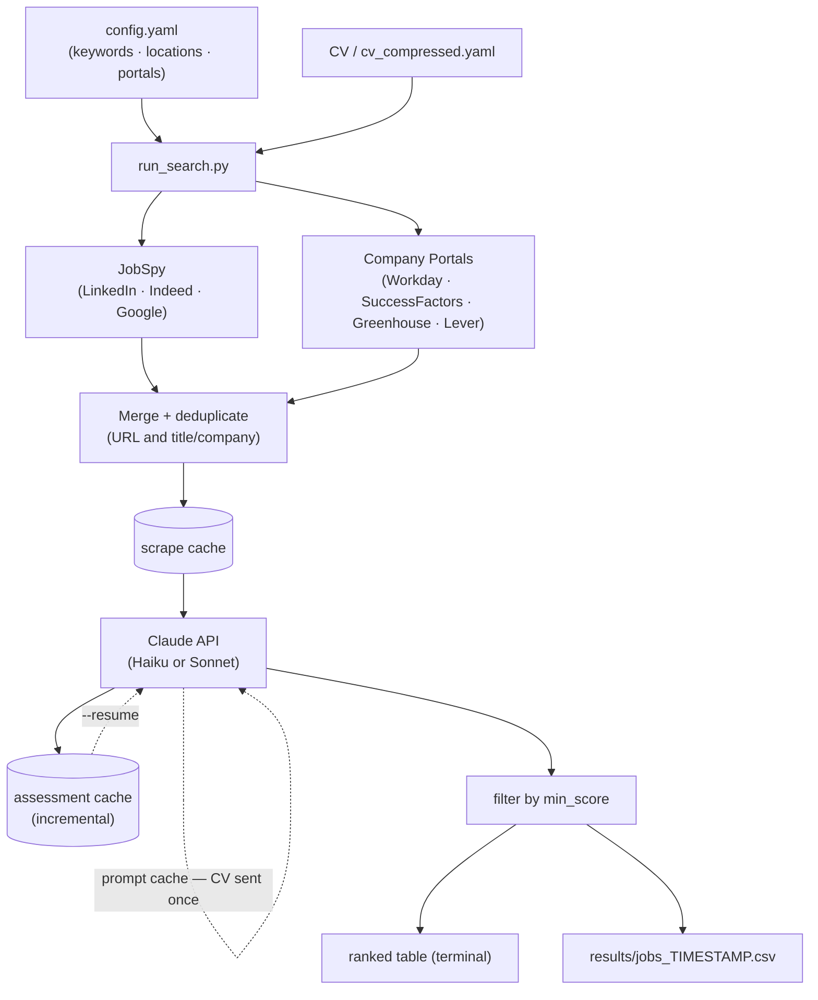

# Job Search Automation

Scrapes job boards and company career portals, then scores each posting against your CV using Claude AI. Results are ranked by fit and saved as a CSV.

## How it works



Prompt caching means your CV is uploaded once per run — all subsequent assessments read it from cache at ~10× lower cost.

`--resume` skips re-scraping and skips already-assessed jobs, picking up exactly where an interrupted run left off.

## Features

- **Multi-source scraping** — LinkedIn, Indeed, Google via [JobSpy](https://github.com/speedyapply/JobSpy), plus direct company portals
- **Company portals** — Workday (CXS API), SAP SuccessFactors (HTML), Greenhouse (JSON API), Lever (JSON API)
- **Location filtering** — ISO 3166 country codes + configurable city overrides
- **AI fit scoring** — Claude scores each job 1–10 with reasoning, matching skills, and concerns
- **Prompt caching** — CV sent once per run; all assessments read from cache
- **Resumable runs** — `--resume` continues interrupted runs without re-scraping or re-assessing
- **Deduplication** — by URL and by title/company across all sources

## Setup

### 1. Clone and create environment

```bash
git clone <your-repo-url>
cd job_search_automation
conda create -n job_search python=3.11 -y
conda activate job_search
pip install -r requirements.txt
```

### 2. Add your API key

```bash
cp .env.example .env
# edit .env: ANTHROPIC_API_KEY=sk-ant-...
```

Get a key at [console.anthropic.com](https://console.anthropic.com/settings/keys).

### 3. Configure your search

```bash
cp config.example.yaml config.yaml
```

Edit `config.yaml` — it is gitignored and stays private.

### 4. Add your CV

```
cv/cv.pdf     ← PDF preferred
cv/cv.txt     ← plain text also works
```

The `cv/` folder is gitignored.

### 5. Compress your CV (recommended, one-time)

Compresses your CV to a compact YAML profile, reducing token usage on every run:

```bash
python run_search.py --compress-cv
```

Saves `cv/cv_compressed.yaml` (gitignored). Review and edit it — this is what Claude uses to assess fit.

## Usage

```bash
conda activate job_search

python run_search.py                      # full run
python run_search.py --resume             # continue interrupted run
python run_search.py --min-score 8       # override minimum score
python run_search.py --dry-run           # scrape only, skip AI scoring
python run_search.py --cv cv/cv.pdf      # force a specific CV file
python run_search.py --compress-cv       # compress CV, then run
python run_search.py --clear-score-cache # reset score cache (after updating CV)
```

Results are saved to `results/jobs_YYYYMMDD_HHMMSS.csv`.

## Configuration reference

### `search`

| Key | Description |
|---|---|
| `keywords` | Job titles / search terms |
| `locations` | Country names or `"Remote"` — used by JobSpy and portal location filter |
| `sites` | JobSpy sources: `linkedin`, `indeed`, `google` |
| `hours_old` | Only jobs posted in the last N hours |
| `results_per_site` | Max results per keyword × location × site |
| `country_indeed` | Indeed country routing (e.g. `Germany`) |
| `linkedin_fetch_description` | Fetch full LinkedIn descriptions (slower, better assessments) |
| `location_city_map` | Optional `"City": "Country"` overrides for Workday bare-city strings |

### `assessment`

| Key | Default | Description |
|---|---|---|
| `model` | `claude-haiku-4-5` | Scoring model (`claude-haiku-4-5` = fast/cheap, `claude-sonnet-4-6` = higher quality) |
| `compression_model` | `claude-sonnet-4-6` | Model for the one-time CV compression |
| `min_score` | `6` | Minimum fit score included in the summary |
| `max_description_chars` | `4000` | Truncate job descriptions to this length |
| `max_input_tokens` | `3000` | Skip jobs exceeding this token count (no API cost) |

### `company_portals`

| Key | Description |
|---|---|
| `fetch_workday_descriptions` | Fetch full Workday job descriptions (slower, better assessments) |
| `fetch_successfactors_descriptions` | Fetch full SuccessFactors descriptions (fast, on by default) |
| `greenhouse` | List of `{token, name}` entries |
| `lever` | List of `{slug, name}` entries |
| `workday` | List of `{api_url, name}` entries |
| `successfactors` | List of `{base_url, name}` entries |

## Adding company portals

### Workday

Open the company's careers page, search for a job, and inspect DevTools → Network for a `POST` request matching `.../wday/cxs/.../jobs`:

```yaml
workday:
  - name: "Novartis"
    api_url: "https://novartis.wd3.myworkdayjobs.com/wday/cxs/novartis/Novartis_Careers/jobs"
```

### SAP SuccessFactors

Use the careers site root URL (the scraper appends `/search/` automatically):

```yaml
successfactors:
  - name: "BioNTech"
    base_url: "https://jobs.biontech.com"
```

### Greenhouse

Token comes from `boards-api.greenhouse.io/v1/boards/{token}/jobs`:

```yaml
greenhouse:
  - token: "your-company"
    name: "Company Name"
```

### Lever

Slug comes from `api.lever.co/v0/postings/{slug}`:

```yaml
lever:
  - slug: "your-company"
    name: "Company Name"
```

### Location filtering for bare-city Workday results

Some Workday portals return only a city name (e.g. `"Basel"` instead of `"Basel, Switzerland"`). The ISO-code matcher can't resolve these automatically. Add a `location_city_map` under `search`:

```yaml
search:
  locations:
    - "Switzerland"
    - "Germany"
  location_city_map:
    "Basel": "Switzerland"
    "Schaftenau": "Austria"
    "Biberach": "Germany"
```

## What's gitignored

| Path | Why |
|---|---|
| `.env` | API key |
| `config.yaml` | personal keywords and locations |
| `cv/` | CV and compressed profile |
| `results/` | scraped job data |

## Requirements

- Python 3.11+
- Anthropic API key ([console.anthropic.com](https://console.anthropic.com))
- CV as PDF or plain text
