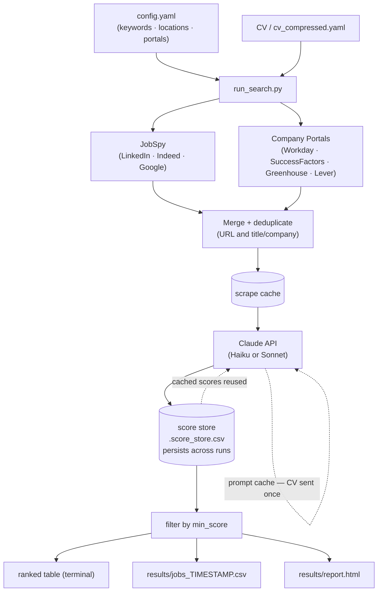

# Job Search Automation

Scrapes job boards and company career portals, then scores each posting against your CV using Claude AI. Results are ranked by fit, saved as a persistent score store, and published as a self-contained HTML report.

## How it works



Prompt caching means your CV is uploaded once per run — all subsequent assessments read it from cache at ~10× lower cost.

The **score store** persists across runs: jobs seen before are not re-assessed, saving API calls on every subsequent run. Use `--clear-score-cache` after updating your CV.

## Features

- **Multi-source scraping** — LinkedIn, Indeed, Google via [JobSpy](https://github.com/speedyapply/JobSpy), plus direct company portals
- **Company portals** — Workday (CXS API), SAP SuccessFactors (HTML), Greenhouse (JSON API), Lever (JSON API)
- **Location filtering** — country names, ISO 3166 codes, and configurable city overrides
- **AI fit scoring** — Claude scores each job 0–100% with reasoning, matching skills, concerns, and seniority assessment
- **Industry preference** — configurable score penalty for academia / government / non-profit postings
- **Persistent score cache** — jobs are not re-assessed across runs; scores accumulate over time
- **HTML report** — self-contained `results/report.html` with filter bar (score, seniority, site, NEW badge)
- **Prompt caching** — CV sent once per run; all assessments read from cache
- **Resumable runs** — `--resume` continues interrupted runs without re-scraping or re-assessing
- **Deduplication** — by URL and by title/company across all sources

## Local setup

### 1. Clone and create environment

```bash
git clone <your-repo-url>
cd job_search_automation
conda create -n job_search python=3.11 -y
conda activate job_search
pip install -r requirements.txt
```

### 2. Add your API key

```bash
cp .env.example .env
# edit .env: ANTHROPIC_API_KEY=sk-ant-...
```

Get a key at [console.anthropic.com](https://console.anthropic.com/settings/keys).

### 3. Configure your search

```bash
cp config.example.yaml config.yaml
```

Edit `config.yaml` — it is gitignored and stays private.

### 4. Add your CV

```
cv/cv.pdf     ← PDF preferred
cv/cv.txt     ← plain text also works
```

The `cv/` folder is gitignored.

### 5. Compress your CV (recommended, one-time)

Compresses your CV to a compact YAML profile, reducing token usage on every run:

```bash
python run_search.py --compress-cv
```

Saves `cv/cv_compressed.yaml` (gitignored). Review and edit it — this is what Claude uses to assess fit.

## Usage

```bash
conda activate job_search

python run_search.py                        # full run
python run_search.py --resume               # continue interrupted run
python run_search.py --min-score 70         # override minimum display score (0-100)
python run_search.py --dry-run             # scrape only, skip AI scoring
python run_search.py --cv cv/cv.pdf        # force a specific CV file
python run_search.py --compress-cv         # compress CV, then run
python run_search.py --clear-score-cache   # reset score cache (after updating CV)
python run_search.py --check-active        # re-check old job URLs for liveness
```

Results are saved to `results/jobs_YYYYMMDD_HHMMSS.csv` and `results/report.html`.

## Cover letter generator

A Streamlit app that generates a tailored cover letter draft using Claude, lets you edit every field, and exports a one-page A4 PDF.

```bash
streamlit run cover_letter_app.py
```

**Workflow:**
1. Select your CV file (uses `cv/cv_compressed.yaml` if available, falls back to PDF/txt)
2. Paste the job description — or pick a scored job directly from the score store dropdown
3. Optionally add a draft or bullet points to guide Claude
4. Click **Generate with Claude** — fills in the recipient address, subject, and letter body
5. Edit any field: sender info, address block, date, subject, main text
6. Click **Download PDF** — font auto-scales from 11 pt down to 9 pt to guarantee one page

The PDF is regenerated live as you type, so the download button always reflects your latest edits.

---

## GitHub Actions setup (automated weekly search)

The included workflow (`.github/workflows/weekly_search.yml`) runs the search every Monday at 08:00 Basel time and can also be triggered manually.

### 1. Fork or copy the repository

Make sure `.github/workflows/weekly_search.yml` is present.

### 2. Set up Supabase (optional but recommended)

The workflow uses Supabase to persist the score store between runs. Without it, scores reset every run.

1. Create a free project at [supabase.com](https://supabase.com)
2. Run this SQL in the SQL editor to create the jobs table:

```sql
create table if not exists job_scores (
    job_url text primary key,
    fit_score integer,
    job_sector text,
    seniority_match text,
    fit_reasoning text,
    matching_skills text,
    concerns text,
    assessed_at date,
    is_active text,
    title text,
    company text,
    location text,
    site text,
    date_posted text,
    description text
);
```

3. Note your **Project URL** and **service_role key** (Settings → API).

### 3. Add GitHub Actions secrets

Go to your repository → **Settings** → **Secrets and variables** → **Actions** → **New repository secret**.

| Secret name | Value |
|---|---|
| `ANTHROPIC_API_KEY` | Your Anthropic API key |
| `CONFIG_YAML` | Full contents of your `config.yaml` |
| `CV_YAML` | Full contents of `cv/cv_compressed.yaml` (run `--compress-cv` locally first) |
| `SUPABASE_URL` | Your Supabase project URL (e.g. `https://xyz.supabase.co`) |
| `SUPABASE_SERVICE_ROLE_KEY` | Your Supabase service role key |

> `CONFIG_YAML` and `CV_YAML` are multiline secrets — paste the full file content directly into the secret value field.

### 4. Trigger a test run

Go to **Actions** → **Weekly Job Search** → **Run workflow** to trigger a manual run and verify everything works.

### Skipping Supabase

If you don't want Supabase, remove the two Supabase steps from `weekly_search.yml` and omit those two secrets. Scores will not persist between runs.

## Configuration reference

### `search`

| Key | Description |
|---|---|
| `keywords` | Job titles / search terms |
| `locations` | Country names or `"Remote"` — used by JobSpy and portal location filter |
| `sites` | JobSpy sources: `linkedin`, `indeed`, `google` |
| `hours_old` | Only jobs posted in the last N hours |
| `results_per_site` | Max results per keyword × location × site |
| `country_indeed` | Indeed country routing (e.g. `Germany`) — only one country supported |
| `linkedin_fetch_description` | Fetch full LinkedIn descriptions (slower, better assessments) |
| `location_city_map` | Optional `"City": "Country"` overrides for Workday bare-city strings |

### `assessment`

| Key | Default | Description |
|---|---|---|
| `model` | `claude-haiku-4-5` | Scoring model (`claude-haiku-4-5` = fast/cheap, `claude-sonnet-4-6` = higher quality) |
| `compression_model` | `claude-sonnet-4-6` | Model for the one-time CV compression |
| `min_score` | `60` | Minimum fit score (0–100) shown in summary and HTML report |
| `max_description_chars` | `4000` | Truncate job descriptions to this length |
| `max_input_tokens` | `3000` | Skip jobs exceeding this token count (no API cost) |
| `industry_malus` | `15` | Points deducted from non-industry jobs (academia, government, non-profit). Set to `0` to disable. Use `--clear-score-cache` after changing. |

### `output`

| Key | Default | Description |
|---|---|---|
| `results_dir` | `results` | Directory for CSV results, HTML report, and cache files |

### `company_portals`

| Key | Description |
|---|---|
| `fetch_workday_descriptions` | Fetch full Workday job descriptions (slower, better assessments) |
| `fetch_successfactors_descriptions` | Fetch full SuccessFactors descriptions (fast, recommended on) |
| `greenhouse` | List of `{token, name}` entries |
| `lever` | List of `{slug, name}` entries |
| `workday` | List of `{api_url, name}` entries |
| `successfactors` | List of `{base_url, name}` entries |

## Adding company portals

### Workday

Open the company's careers page, search for a job, and inspect DevTools → Network for a `POST` request matching `.../wday/cxs/.../jobs`:

```yaml
workday:
  - name: "Novartis"
    api_url: "https://novartis.wd3.myworkdayjobs.com/wday/cxs/novartis/Novartis_Careers/jobs"
```

### SAP SuccessFactors

Use the careers site root URL (the scraper appends `/search/` automatically):

```yaml
successfactors:
  - name: "BioNTech"
    base_url: "https://jobs.biontech.com"
```

### Greenhouse

Token comes from `boards-api.greenhouse.io/v1/boards/{token}/jobs`:

```yaml
greenhouse:
  - token: "your-company"
    name: "Company Name"
```

### Lever

Slug comes from `api.lever.co/v0/postings/{slug}`:

```yaml
lever:
  - slug: "your-company"
    name: "Company Name"
```

### Location filtering for bare-city Workday results

Some Workday portals return only a city name (e.g. `"Basel"` instead of `"Basel, Switzerland"`). The ISO-code matcher can't resolve these automatically. Add a `location_city_map` under `search`:

```yaml
search:
  locations:
    - "Switzerland"
    - "Germany"
  location_city_map:
    "Basel": "Switzerland"
    "Schaftenau": "Austria"
    "Biberach": "Germany"
```

## What's gitignored

| Path | Why |
|---|---|
| `.env` | API key |
| `config.yaml` | personal keywords and locations |
| `cv/` | CV and compressed profile |
| `results/` | scraped job data and score cache |

## Requirements

- Python 3.11+
- Anthropic API key ([console.anthropic.com](https://console.anthropic.com))
- CV as PDF or plain text
